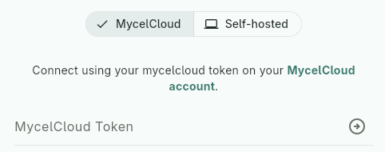
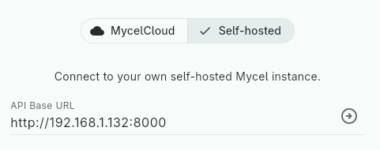

# API Communication

<!-- !!! note "Where to start" -->
<!--     If you're just getting started, read **Setup & Authentication**  -->
<!--     first — the rest of this page (versioning, error handling,  -->
<!--     idempotency) can be read in any order or used as reference later. -->

## Setup communication with Mycel

Mycel exposes a [REST API](../api/index.md) that you'll want to reach 
to communicate with it.

### API Base URL

Since Mycel can be self-hosted or reached through MycelCloud, your 
client needs a way for the user to set and modify this base URL — this 
is the URL your client will send requests to. For example: 
`http://192.168.1.10:8000` (self-hosted) or `https://api.mycelcloud.com` 
(MycelCloud).

Provide a dedicated field to allow this, and ensure it persists across restarts.

!!! tip "URL sanitization"
    Users can easily make mistakes when entering a URL. It's a good 
    idea to sanitize and standardize it: add `http://` or `https://` 
    if missing, trim whitespace, remove a trailing `/`, and so on.

#### MycelCloud Token 

To allow communication with MycelCloud, a token field should be 
provided — without it, users on MycelCloud won't be able to 
use your client at all.

Tell your user to visit https://mycelcloud.com to obtain their token 
and paste it into the dedicated field. Make sure to trim it on your end.

You'll then just have to pass the token in every request to Mycel — 
it will automatically authenticate the user from it. Add 
`{"Authorization": "Bearer $token"}` to the header.

!!! tip "No need to conditionally send the token"
    MycelCloud requires the token to function, but if the user is 
    self-hosting Mycel, sending a token anyway won't cause an error. 
    So there's no need to distinguish the two cases — you can always 
    send whatever token the user has entered, even if empty.

??? example "UI suggestion"
    You could offer a toggle between two sections: one requesting the 
    API base URL (self-hosted), the other requesting the token 
    (MycelCloud) — though any UI pattern works, as long as users can 
    easily provide the right one. In MycelCloud mode, the base URL can 
    simply be hardcoded to `https://api.mycelcloud.com` — no need to 
    expose it to the user.

    <div class="grid" markdown>

    

    

    </div>

### Version compatibility

All requests may include the `X-Mycel-Version` header to indicate the 
minimum Mycel version your implementation requires (e.g. `2.3.0`). If 
provided, Mycel will verify compatibility and return a `version` 
[error](#error-handling) if incompatible — see [Versioning](./versioning.md) 
for the full compatibility rules.

??? note "Custom compatibility rules"
	This header is not required — you can choose not to send it. 
	However, omitting any kind of version check comes with risks: your 
	client may silently break against incompatible Mycel versions. If you 
	want to apply custom compatibility rules beyond what Mycel checks, use 
	the `GET /version` endpoint and implement your own logic in your client.
	
### Request & Response Format

Mycel follows the standard REST conventions described in the 
[API reference](../api/index.md).
All API calls are relative to this base URL — e.g. `POST {base_url}/collections/{col_id}/reviews/undo`.

Domain endpoints always return the same response format, wrapping the 
result in a `data` field: `{"data": <response>}`, while system 
endpoints follow a different format, detailed in the 
[API reference](../api/index.md).

### Initiate communication

To check if Mycel is reachable, you may want to use the system 
endpoint `GET /health`. It will return `200` if reachable.

!!! tip "Any endpoint works"
    The same version and connectivity checks run on every request, so 
    you could just as well use any other endpoint instead of `/health` 
    — it's simply a convenient, lightweight default for this purpose.

If there's no problem, you're ready to reach the user's data!

## Error handling

[See Mycelium example](https://github.com/mycel-project/mycelium/tree/main/lib/data/network)

Mycel distinguishes five categories of errors.

- **Network errors** occur when the server cannot be reached at all: connection refused, timeout, DNS failure, and so on. These produce no HTTP response and no body. The recommended approach is to catch them at the transport layer and retry with backoff before surfacing anything to the user.
- **Authentication errors** (type: "auth") are returned by MycelCloud when a request cannot be authorized. These cover invalid or expired tokens, missing credentials, and subscription issues. They should be handled at the top level of your client, before any business logic runs, typically by notifying the user and prompting them to take action. See [auth error reference](../manual/auth-errors.md).
- **Domain errors** (type: "domain") represent logically invalid operations like requesting a resource that does not exist, violating a business rule, ... These are expected errors that your services should catch and handle specifically. Each endpoint in API reference documents the domain errors it can produce.
- **Version errors** (type: "version") indicate that your implementation and the Mycel instance are not compatible. This can happen if Mycel is outdated compared to what your implementation requires, or if the major versions differ. The recommended approach is to block all further calls and display a clear message to the user. See [Versioning section](./versioning.md) for more details.
- **Internal errors** (type: "internal") are unexpected failures. They should not be caught silently. The recommended approach is to surface the raw error to the user and encourage them to report it.

All non-network errors share the same response format:
```
HTTP status code
{"detail": {"type": "...", "code": "...", "message": "..."}}
```

A basic pattern for handling these layers:
```Pseudocode
try:
    response = call_mycel(...)
except NetworkError:
    retry or notify user, server unreachable

if response.status != 200:
    error = response.body.detail
	if error.type == "auth":
		match error.code:
			"invalid_token"   -> notify user, offer to open settings
			"token_expired"   -> notify user, offer to open settings
			"missing_token"   -> notify user, offer to open settings
			"not_subscribed"  -> notify user, link to mycelcloud.com
			"service_unavailable" -> notify user
		return
		
	elif error.type == "version":
		block everything
		display error.message or custom message to user
		return

	elif error.type == "internal":
		log error
		notify user, suggest reporting the issue
		return

    # domain falls through
	elif error.type == "domain":
		pass 
		let services handle the specific code

	# Fallback - unknown error type
	else:
		log error
		notify user, suggest reporting the issue
		return

handle response.data 
```

And within a service:
```Pseudocode
try:
    handle_response(response)
except MycelError as e:
    if e.code == "NODE_NOT_FOUND":
        # handle specifically
    if e.code == "NOT_A_SPORE":
        # handle specifically
```

## Idempotency

Mycel implements server-side idempotency for non-idempotent endpoints, 
marked as such in the API reference. Using this protection is optional 
but recommended.

To benefit from this protection, include an `Idempotency-Key` header 
with a unique UUID per user action:

```http
POST /collections/{col_id}/reviews/undo
Idempotency-Key: 550e8400-e29b-41d4-a716-446655440000
```

If the same key is sent again within 1 hour, Mycel returns the 
original response without re-executing the operation.

This header is optional but strongly recommended for non-idempotent 
endpoints — omitting it exposes your client to instability from 
network retries or accidental double calls. For best results, generate 
the key at the action level and reuse it on retries, rather than 
generating a new key per call.

!!! tip "Bonus: preventing spam client-side"
    Beyond idempotency keys, you can also prevent spam by temporarily 
    disabling a user-triggered action until it completes or times out.
