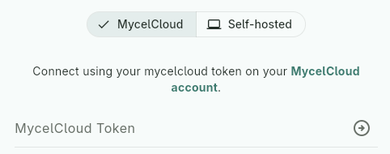
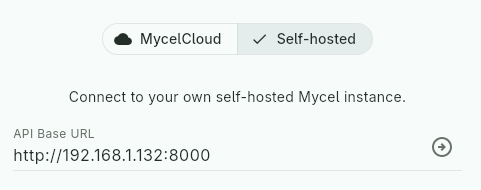

# Setup & Basics

Mycel exposes a [REST API](../../reference/api.md) that you'll want to reach
to communicate with it.

## API Base URL

**Required**{: .badge .badge-required}

Since Mycel can be self-hosted or reached through MycelCloud, your
client needs a way for the user to set and modify this base URL — this
is the URL your client will send requests to. For example:
`http://192.168.1.10:8000` (self-hosted) or `https://api.mycelcloud.com`
(MycelCloud).

Provide a dedicated field to allow this, and ensure it persists across restarts.

!!! tip "URL sanitization"
    Users can easily make mistakes when entering a URL. It's a good
    idea to sanitize and standardize it: add `http://` or `https://`
    if missing, trim whitespace, remove a trailing `/`, and so on.

### MycelCloud Token

To enable communication with MycelCloud, provide a field for users to enter their authentication token. Include this token in the `Authorization` header of every request as `Bearer $token`. MycelCloud will automatically authenticate the user based on this token.

!!! tip "No need to conditionally send the token"
    MycelCloud requires the token to function, but if the user is
    self-hosting Mycel, sending a token anyway won't cause an error.
    So there's no need to distinguish the two cases — you can always
    send whatever token the user has entered, even if empty.

??? example "UI suggestion"
    You could offer a toggle between two sections: one requesting the
    API base URL (self-hosted), the other requesting the token
    (MycelCloud) — though any UI pattern works, as long as users can
    easily provide the right one. In MycelCloud mode, the base URL can
    simply be hardcoded to `https://api.mycelcloud.com` — no need to
    expose it to the user.

    

    

    

    

## Version compatibility

All requests may include the `X-Mycel-Version` header to indicate the
minimum Mycel version your implementation requires (e.g. `2.3.0`). If
provided, Mycel will verify compatibility and return a `version`
[error](error-handling.md) if incompatible — see [Versioning](../../reference/versioning.md)
for the full compatibility rules.

??? note "Custom compatibility rules"
	This header is not required — you can choose not to send it.
	However, omitting any kind of version check comes with risks: your
	client may silently break against incompatible Mycel versions. If you
	want to apply custom compatibility rules beyond what Mycel checks, use
	the `GET /version` endpoint and implement your own logic in your client.

## Request & Response Format

Mycel follows the standard REST conventions described in the
[API reference](../../reference/api.md).
All API calls are relative to this base URL — e.g. `POST {base_url}/collections/{col_id}/reviews/undo`.

Domain endpoints always return the same response format, wrapping the
result in a `data` field: `{"data": <response>}`, while system
endpoints follow a different format, detailed in the
[API reference](../../reference/api.md).

## Initiate communication
**Required**{: .badge .badge-required}

To check if Mycel is reachable, you can use the GET /health endpoint. It should return 200 when everything is working as expected, but if not, let’s see what errors you may encounter in the next section!

!!! note "Most endpoint works"
	The same version and connectivity checks are performed on every request that requires an authentication token, so you could just as well use any other endpoint instead of /health — it’s simply a convenient, lightweight default for this purpose.
