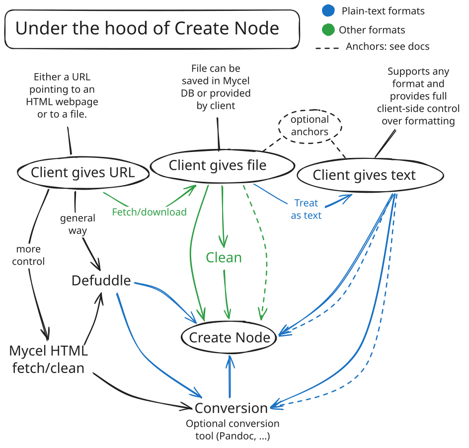

# Importing resources

The diagram below covers the foundations of Mycel's import system: how a URL, a file, or raw text each get processed before reaching Create Node, the single endpoint that ties everything together.

