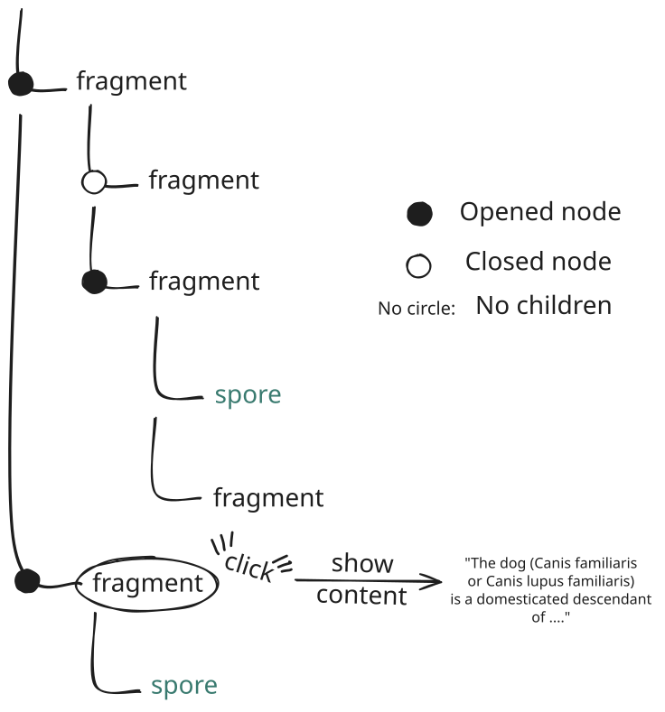

# Node Tree

The Node Tree is the structure in which all nodes are represented under a parent-child hierarchy, allowing quick visualization and navigation between nodes.

Think of it like a classic folder structure, except each node carries both content and children.

See in the schema that only fragments can have children. Spores cannot, as they are already the result of the decomposition of fragments.

## Create a Node Tree

First, check whether your environment already provides something that resembles this recursive hierarchical structure, as this would greatly simplify the task. You should then integrate with that tool's API to create your node tree, use a dedicated package, or build your own viewer.

When fetching nodes from the API, they come with a `parent_id` field that you can use to build the object hierarchy.

If a node has an empty `parent_id` field, it means that it is a root node. Make sure to handle the case where a node has a `parent_id` but the parent node is not present in your node pool (for example, because it has not been fetched yet or has been deleted). In this case, displaying it as a root might be a good option.

### Content preview

The "fragment" and "spore" placeholders used in the top schema would be replaced by the node title (stored in NodeView > data) or content_preview: see [NodeView](https://github.com/mycel-project/mycel/blob/main/src/schemas/node_view.py).

In both cases, you should remove line breaks and trim the text to a reasonable length to keep the visualization clear. The content_preview is already trimmed by Mycel, but it is probably still too long for a Node Tree preview and may contain line breaks.

### Navigate in the Tree

Depending on your platform, provide a way to expand and collapse node subtrees, either through a keyboard shortcut or by clicking, for instance, on a toggle indicator on the left. Clicking directly on the content preview should be used to open the node's full content.

### Styling

If you can customize the NodeTree's theme, you can distinguish Spore nodes from Fragment nodes using different colors, and dim dismissed fragments. You can determine whether a Fragment is dismissed by inspecting the `dismiss` field of its Learning Unit (Fragment Nodes only have one Learning Unit).
