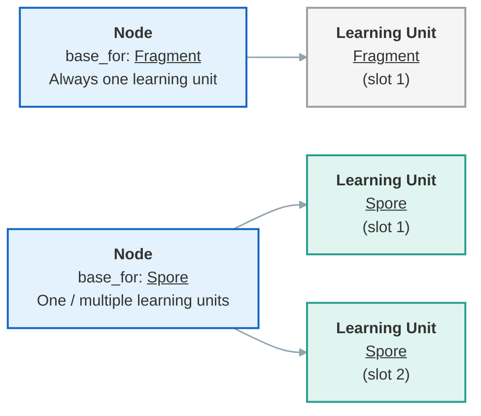

# Fundations

**Required**{: .badge .badge-required} 

There are a few concepts that should be grasped in order to implement 
Node in your client. 

## Fragment vs Spore

Nodes in Mycel come in two flavors:

- **Fragment** — learning material actively broken down through recursive extractions.
- **Spore** — active learning material reviewed through spaced repetition.

Through review session fragments are recursively broken down and replaced by spore.

## Node vs Learning Unit

A **Node** does not directly 
hold the learning data. Instead, it stores *shared information* such as 
the textual content, across **Learning Units**, which 
store the *review data* (due date, priority, ...).

!!! question "Why is there a "slot" field?"
    The `slot` field distinguishes multiple learning units on the same node. It starts at 1 and goes up to the number of learning units attached.

This separation allows multiple learning units to share the same 
content — for example, to generate multiple Spores from a single text content.

??? example "A small example"
	Say you want to learn: `Capital of France: Paris`, in both directions (capital → country, country → capital).
	
	Using cloze fields, it would be: `Capital of {{c1::France}}: {{c2::Paris}}`.
	
	The raw content `Capital of {{c1::France}}: {{c2::Paris}}` is stored in a Spore **Node** and shared across two Spore **Learning Units**, each storing separate learning data for its direction.
	
	The capital → country direction could be due in 10 days, whereas country → capital could be due in 1 month. Without the Node / Learning Unit separation, this wouldn't be possible, or would require dirty duplication of content.

## Handling the distinction

Fortunately, most of this logic is hidden from clients, who work with Node and Learning Units as a single concept.

The API never exposes learning unit IDs directly: you always work with `node_id` + `slot`.

!!! tip "How it maps to the API"
	See the [API reference](../../../reference/api.md) — there are separate "Nodes" and "Learning Units" sections. Learning Unit endpoints exist for convenience and map directly to their Node counterpart. If you want to avoid handling multiple learning units for a single node, simply always pass 1 as slot number — although this is not recommended.

---

Now let's see how to implement that in practice
