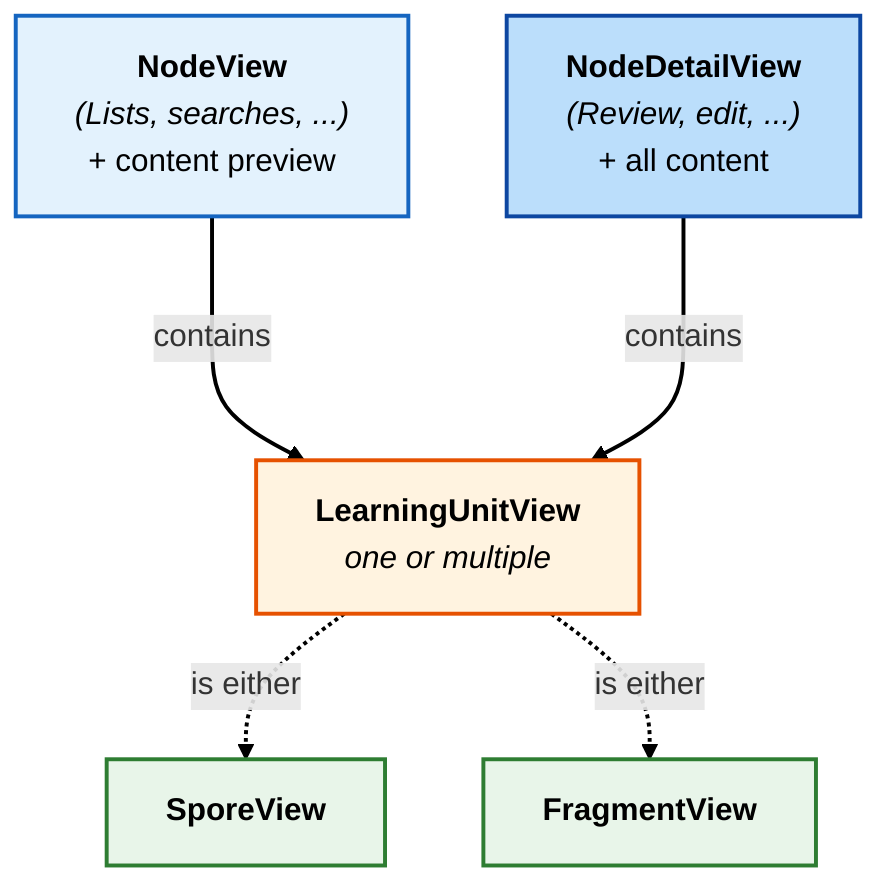

# Modeling Node

!!! question "Why detail Mycel's internal models?"
	While your client only interacts with JSON payloads, understanding Mycel's internal data structure is highly recommended. Conceptually mirroring this architecture in your client will help you when handling polymorphism, deserialization, and local caching. See all Mycel's [Models](https://github.com/mycel-project/mycel/tree/main/src/models) and [Schemas](https://github.com/mycel-project/mycel/tree/main/src/schemas) for more details.

Both Spore and Fragment Learning Unit extend from the class `BaseLearningUnit`. 

```mermaid
    graph TB
        Node["<b>Node</b><hr/>+ String id<br/>+ NodeType base_for<br/>+ NodeFields fields<br/>+ List[LearningUnit] learning_units<br/>..."]
        
        BaseLU["<b>&laquo;Abstract&raquo;<br/>BaseLearningUnit</b><br/>+ String id<br/>+ String node_id<br/>+ int slot<br/>+ int due<br/>+ int last_review<br/>..."]

        subgraph LearningUnits ["Learning Units (Spore & Fragment)"]
            direction TB
            Spore["<b>Spore</b><br/>+ String type = 'spore'<br/>+ LearningData learning_data<br/>..."]
            Fragment["<b>Fragment</b><br/>+ String type = 'fragment'<br/>+ bool dismiss<br/>+ FragmentRef ref<br/>..."]
        end

        Node -- "contains (1..*)" --> BaseLU
        
        BaseLU <-- "extends" --- Spore
        BaseLU <-- "extends" --- Fragment

        style Node fill:#e3f2fd,stroke:#1565c0,stroke-width:2px,color:#000000
        style BaseLU fill:#f5f5f5,stroke:#9e9e9e,stroke-width:2px,color:#000000
        style Spore fill:#e8f5e9,stroke:#2e7d32,stroke-width:2px,color:#000000
        style Fragment fill:#e8f5e9,stroke:#2e7d32,stroke-width:2px,color:#000000
        style LearningUnits fill:#f9fbe7,stroke:#827717,stroke-width:2px,stroke-dasharray: 5 5,color:#000000
        
        linkStyle default stroke:#000000,stroke-width:2px

```

When fetching nodes, the API condenses this internal structure (Node + attached Learning Units) into specific views to optimize payload size. Depending on the endpoint, it returns either:

- [NodeView](https://github.com/mycel-project/mycel/blob/main/src/schemas/node_view.py) — A lightweight model used for lists and searches. It contains node metadata and attached learning units, but strips the full content in favor of a short content_preview.
- [NodeDetailView](https://github.com/mycel-project/mycel/blob/main/src/schemas/node_detail_view.py) — The complete model. It inherits from NodeView but also includes the full fields dictionary (the complete text content). Used when loading a specific node for editing or review.

In both cases, Nodes always comes with their full [LearningUnitView](https://github.com/mycel-project/mycel/blob/main/src/schemas/learning_unit_view.py): [FragmentView](https://api.mycelcloud.com/scalar#models/FragmentView) or [SporeView](https://api.mycelcloud.com/scalar#models/SporeView).



!!! tip "Visualize that in the API"
	For instance, see in the [API reference](../../../reference/api.md) that [List Nodes](https://api.mycelcloud.com/scalar#tag/nodes/GET/collections/{col_id}/nodes) returns a list of `NodeView` objects, while [Get Node](https://api.mycelcloud.com/scalar#tag/nodes/GET/collections/{col_id}/nodes/{node_id}) returns a `NodeDetailView`. In Scalar, in the `learning_units` field, you can select a `LearningUnitView` (`SporeView` or `FragmentView`).

## Suggested structure

See [Mycelium example](https://github.com/mycel-project/mycelium/blob/main/lib/data/models/node.dart).

### Unified Node model

Instead of creating two distinct models for `NodeView` and `NodeDetailView`, combine them into a single Node model:

- Make all fields **required** except for those that are optional in `NodeView`.
- Add all fields from `NodeDetailView`.

That way, whether mycel sends a lightweight `NodeView` or a complete `NodeDetailView`, your Node model handles it — and the cache is centralized.

### Use polymorphism for Learning Units

Since a single Node can contain different types of learning units (Spores or Fragments), your models need to handle polymorphism.

While the API returns a flat JSON object for a learning unit, you must decide how to structure the shared fields (like `due`, `slot`, or `priority`) versus the type-specific fields (like `learning_data` or `dismiss`) in your code. Depending on your language constraints, you generally have two choices:

1. **Inheritance**: Spore and Fragment directly extend a BaseLearningUnit class that holds all the common fields.
2. **Composition** (chosen architecture for Mycelium): You separate the data storage from the typing. Spore and Fragment internally contain a BaseLearningUnit instance which strictly holds the shared data, while declaring their specific fields in their own classes. A generic LearningUnit interface allows grouping both types in a single List<LearningUnit>.

### Deserialization by type

Since the Node's learning_units field can contain either `FragmentView` or `SporeView`, you need to deserialize based on a type discriminator in the JSON. See the "switch" pattern in the [Mycelium example](https://github.com/mycel-project/mycelium/blob/main/lib/data/models/node.dart) in the factory of the sealed class LearningUnit.

## Secondary models

You can also create models for `NodeType`, `NodeData`, `NodeFields`, etc., but it is less necessary — the unified Node model already covers the main use cases.

For endpoints that return formatted data rather than full nodes (such as "Get Priorities" or "Create Node Extract"), you may create dedicated models. In Mycelium, the "Get Priorities" response is parsed directly and saved into `NodeCache` without passing through an additional model.

---

With this structure in place, you are now ready to load nodes.
